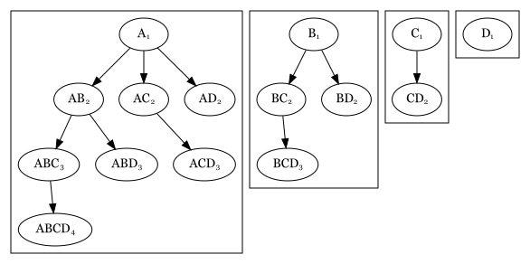

# Best practices

## Introduction

There are some rules of thumb that I follow when using the
`TreatmentPatterns` package. These rules tend to work well in most
situations, across databases and datasets.

### TLDR

- `minPostCombinationWindow <= minEraDuration`.
- `combinationWindow >= minEraDuration`.
- Small cohorts should not be considered.
- Pathways with a low count should not be considered.
- Possible number of pathways: $n^{n}$
- Possible number of pathways, with no re-occurrence: $n!$
- Total number of possible events (events + combinations): $2^{n} - 1$
- Total number of possible combinations: $2^{n} - (n + 1)$

## Cohorts

When creating cohorts, it is important to keep in mind that the subjects
will be dived across pathways. Lets assume we have 10000 subjects in a
fictitious cohort. Let’s also assume we have 5 event cohorts.

The total number of potential pathways, assuming only mono therapies
equals to $pathways_{n} = n^{n}$, assuming we do not allow for any
re-occurring treatments it would still equal to $pathways_{n} = n!$.

Assuming our 5 event cohorts this would equal to:

``` r
5^5
```

    ## [1] 3125

``` r
factorial(5)
```

    ## [1] 120

## Combinations

Combinations add additional pathway possibilities. Each event can be
uniquely combined with each other event. Each combination can combine
with another singular event or any other combination. However, each
event in a combination must be unique. So: $AB = BA$. As an example it
is irrelevant if a person receives penicillin and ibuprofen or ibuprofen
and penicillin.

We can draw out all possible combinations in a graph for events
$A$$B$$C$.



The subscript of the nodes are the layers where the combination exists
in. I.e. combination $AB$ is in layer 2, and combinations $ABCD$ is in
layer 4. The layer coincides with the number of events in the
combination.

We can count the number of nodes per layer, for each graph:
$$\begin{matrix}
 & {l1} & {l2} & {l3} & {l4} & {sum} \\
A & 1 & 3 & 3 & 1 & 8 \\
B & 1 & 2 & 1 & 0 & 4 \\
C & 1 & 1 & 0 & 0 & 2 \\
D & 1 & 0 & 0 & 0 & 1
\end{matrix}$$

Our sums look suspiciously similar to $2^{n}$.

``` r
2^1
```

    ## [1] 2

``` r
2^2
```

    ## [1] 4

``` r
2^3
```

    ## [1] 8

``` r
2^4
```

    ## [1] 16

We seem to overshoot by 1 $n$, so we can try $2^{n - 1}$.

``` r
2^0
```

    ## [1] 1

``` r
2^1
```

    ## [1] 2

``` r
2^2
```

    ## [1] 4

``` r
2^3
```

    ## [1] 8

So our total number of events equals:
$$\sum\limits_{i = 0}^{n - 1}2^{i}$$

Which we can define as a function $f_{1}$.

``` r
sum(c(2^0, 2^1, 2^2, 2^3))
```

    ## [1] 15

``` r
# Or:
n <- 4
sum(2^(0:(n - 1)))
```

    ## [1] 15

``` r
f_1 <- function(n) {
  sum(2^(0:(n - 1)))
}
```

We can simulate our $f_{1}$ function for 100 events.

``` r
n <- 1:25
f_1_events <- unlist(lapply(n, f_1))

data.frame(
  n = n,
  f_1 = f_1_events
)
```

    ##     n      f_1
    ## 1   1        1
    ## 2   2        3
    ## 3   3        7
    ## 4   4       15
    ## 5   5       31
    ## 6   6       63
    ## 7   7      127
    ## 8   8      255
    ## 9   9      511
    ## 10 10     1023
    ## 11 11     2047
    ## 12 12     4095
    ## 13 13     8191
    ## 14 14    16383
    ## 15 15    32767
    ## 16 16    65535
    ## 17 17   131071
    ## 18 18   262143
    ## 19 19   524287
    ## 20 20  1048575
    ## 21 21  2097151
    ## 22 22  4194303
    ## 23 23  8388607
    ## 24 24 16777215
    ## 25 25 33554431

Notice how the number of events increases with $2^{n} - 1$.

We define this as $f_{2}$. We can compare $f_{1}$ to $f_{2}$.

``` r
f_2 <- function(n) {
  2^n - 1
}

n <- 1:25
f_1_events <- unlist(lapply(n, f_1))
f_2_events <- unlist(lapply(n, f_2))

data.frame(
  n = n,
  f_1 = f_1_events,
  f_2 = f_2_events
)
```

    ##     n      f_1      f_2
    ## 1   1        1        1
    ## 2   2        3        3
    ## 3   3        7        7
    ## 4   4       15       15
    ## 5   5       31       31
    ## 6   6       63       63
    ## 7   7      127      127
    ## 8   8      255      255
    ## 9   9      511      511
    ## 10 10     1023     1023
    ## 11 11     2047     2047
    ## 12 12     4095     4095
    ## 13 13     8191     8191
    ## 14 14    16383    16383
    ## 15 15    32767    32767
    ## 16 16    65535    65535
    ## 17 17   131071   131071
    ## 18 18   262143   262143
    ## 19 19   524287   524287
    ## 20 20  1048575  1048575
    ## 21 21  2097151  2097151
    ## 22 22  4194303  4194303
    ## 23 23  8388607  8388607
    ## 24 24 16777215 16777215
    ## 25 25 33554431 33554431

Now we can assert the following: \$\$ monoEvents = n \\ totalEvents =
2^n - 1 \\ combinationEvents = totalEvents - n \$\$

``` r
n <- 5
totalEvents <- 2^n - 1
combinationEvents <- totalEvents - n

sprintf("monoEvents: %s", n)
```

    ## [1] "monoEvents: 5"

``` r
sprintf("totalEvents: %s", totalEvents)
```

    ## [1] "totalEvents: 31"

``` r
sprintf("combinationEvents: %s", combinationEvents)
```

    ## [1] "combinationEvents: 26"

## Settings

The `minEraDuration`, `combinationWindow`, and
`minPostCombinationWindow` have significant effects on how the treatment
pathways are built. Conciser the following example:

``` r
library(dplyr)

cohort_table <- tribble(
  ~cohort_definition_id, ~subject_id, ~cohort_start_date,    ~cohort_end_date,
  1,                     1,           as.Date("2020-01-01"), as.Date("2021-01-01"),
  2,                     1,           as.Date("2020-01-01"), as.Date("2020-01-20"),
  3,                     1,           as.Date("2020-01-22"), as.Date("2020-02-28"),
  4,                     1,           as.Date("2020-02-20"), as.Date("2020-03-3")
)

cohort_table
```

    ## # A tibble: 4 × 4
    ##   cohort_definition_id subject_id cohort_start_date cohort_end_date
    ##                  <dbl>      <dbl> <date>            <date>         
    ## 1                    1          1 2020-01-01        2021-01-01     
    ## 2                    2          1 2020-01-01        2020-01-20     
    ## 3                    3          1 2020-01-22        2020-02-28     
    ## 4                    4          1 2020-02-20        2020-03-03

Assume that the target cohort is cohort_definition_id: 1, the rest are
event cohorts.

``` r
cohort_table <- cohort_table %>%
  mutate(duration = as.numeric(cohort_end_date - cohort_start_date))

cohort_table
```

    ## # A tibble: 4 × 5
    ##   cohort_definition_id subject_id cohort_start_date cohort_end_date duration
    ##                  <dbl>      <dbl> <date>            <date>             <dbl>
    ## 1                    1          1 2020-01-01        2021-01-01           366
    ## 2                    2          1 2020-01-01        2020-01-20            19
    ## 3                    3          1 2020-01-22        2020-02-28            37
    ## 4                    4          1 2020-02-20        2020-03-03            12

As you can see, the duration of the treatments are: 19, 37 and 12 days.
Also cohort 3 overlaps with treatment 4 for 8 days.

We can compute the overlap as follows:

``` r
cohort_table <- cohort_table %>%
  # Filter out target cohort
  filter(cohort_definition_id != 1) %>%
  mutate(overlap = case_when(
    # If the result of the next cohort_end_date is NA, set 0
    is.na(lead(cohort_end_date)) ~ 0,
    # Compute duration of cohort_end_date - next cohort_start_date
    # 2020-02-28 - 2020-02-20 = -8
    .default = as.numeric(cohort_end_date - lead(cohort_start_date))))

cohort_table
```

    ## # A tibble: 3 × 6
    ##   cohort_definition_id subject_id cohort_start_date cohort_end_date duration
    ##                  <dbl>      <dbl> <date>            <date>             <dbl>
    ## 1                    2          1 2020-01-01        2020-01-20            19
    ## 2                    3          1 2020-01-22        2020-02-28            37
    ## 3                    4          1 2020-02-20        2020-03-03            12
    ## # ℹ 1 more variable: overlap <dbl>

We see that the overlap between treatment 2 and 3 is `-2`, so rather
than an overlap there is a gap between these treatments. Between
treatment 3 and 4 there is an 8 day overlap. There is no next treatment
after treatment 4, so the overlap is 0, let’s assume our
`minEraDuration = 5`.

We can draw it out like so:

    2:   -------------------
    3:                        -------------------------------------
    4:                                                     ------------

If we set our `minCombinationWindow = 5`, the combination would be
computed for cohort 3 and 4. This would leave us with the following
treatments:

    2:   -------------------
    3:                        -----------------------------
    3+4:                                                   --------
    4:                                                             ----

Treatment 3 now lasts 11 days; Treatment 4 lasts 4 days; and combination
treatment 3+4 lasts 8 days. If our `minPostCombinationDuration` is not
set properly, we can filter out either too many, or too little
treatments.

Assuming we would set `minPostCombinationDuration = 10`, we would lose
treatment 4 and combination treatment 3+4. This would leave us with the
following paths:

    2:   -------------------
    3:                        -----------------------------

    Pathway: 2-3

As a rule of thumb the setting the
`minPostCombinationDuration <= minEraDuration` seems to yield reasonable
results. This would leave us with the following paths
`minPostCombinationDuration = 5`:

    2:   -------------------
    3:                        -----------------------------
    3+4:                                                   --------

    Pathway: 2-3-3+4
