# Computing Pathways

## Target and Event cohorts

TreatmentPatterns build pathways of **event** cohorts, that occur during
a **target** cohort. A target cohort in published studies is usually a
disease. But other use cases is also valid. Like an exposure window to a
drug or treatment.

Events are things that happen during the target cohort window. For
published studies these are usually exposures to drugs or treatments
during a disease. To re-frame that into a research question: **“What is
the order and pathway of treatments during an infection”**.

Our target cohort would be the infection itself, the event cohorts would
be the treatments that occur during the infection.

TreatmentPatterns needs to know which cohort is a target cohort and
which is an event cohort. This can be derived from the cohort set table,
usually generated by either `CDMConnector` or `CohortGenerator`. To let
TreatmentPatterns know which cohort is what kind, we supply a table that
contains a 1) ID, 2) Name, and 3) cohort type. As an example:

| cohortId | cohortName  | type   |
|----------|-------------|--------|
| 1        | Infection   | target |
| 2        | Treatment A | event  |
| 3        | Treatment B | event  |
| 4        | Treatment C | event  |

Like mentioned earlier this table can be easily dirived from a cohort
set generated by `CohortGenerator` or `CDMConnector`. Here is an example
that uses `CDMConnector`. The target cohort is *Viral Sinusitis*, the
events are several treatments:

``` r
library(dplyr)
library(CDMConnector)

cohortSet <- readCohortSet(
  path = system.file(package = "TreatmentPatterns", "exampleCohorts")
)

cohorts <- cohortSet %>%
  # Remove 'cohort' and 'json' columns
  select(-"cohort", -"json", -"cohort_name_snakecase") %>%
  mutate(type = c("event", "event", "event", "event", "exit", "event", "event", "target")) %>%
  rename(
    cohortId = "cohort_definition_id",
    cohortName = "cohort_name",
  )

cohorts
```

    ## # A tibble: 8 × 3
    ##   cohortId cohortName     type  
    ##      <int> <chr>          <chr> 
    ## 1        1 acetaminophen  event 
    ## 2        2 amoxicillin    event 
    ## 3        3 aspirin        event 
    ## 4        4 clavulanate    event 
    ## 5        5 death          exit  
    ## 6        6 doxylamine     event 
    ## 7        7 penicillinv    event 
    ## 8        8 viralsinusitis target

## Database interface

TreatmentPatterns can connect to a database with either `CDMConnector`
using the *CDM-Reference* or with `DatabaseConnector` using the
*ConnectionDetails*. The main difference between the two is that the
connection to the database is managed by TreatmentPatterns when using
`DatabaseConnector`. When using `CDMConnector`, the connectoin is
managed outside of TreatmentPatterns. Either case may be useful
depending on the environment TreatmentPatterns is run in.

It is worth noting that it does not matter how you create your cohorts.
You can use any means to generate a cohort table your heart desires. You
can use OHDSI tools like **ATLAS** or **Capr** to specify cohort
definitions. You can generate them by executing the raw SQL from
**Circe**, or generate them with `CohortGenerator` or `CDMConnector`.
The only thing that matters is that the resulting cohort table:

| cohort_definition_id | subject_id | cohort_start_date | cohort_end_date |
|----------------------|------------|-------------------|-----------------|
| 1                    | 1          | 2020-01-01        | 2020-12-31      |
| 2                    | 1          | 2020-02-04        | 2020-06-27      |
| 3                    | 1          | 2020-07-03        | 2020-08-12      |
| 4                    | 1          | 2020-08-30        | 2020-11-29      |
| 1                    | 2          | 2020-03-01        | 2020-10-30      |
| 2                    | 2          | 2020-05-04        | 2020-06-27      |
| 4                    | 2          | 2020-10-03        | 2020-10-12      |

### CDMConnector

We can use `CDMConnector` to generate cohorts from JSON definitions into
the *cohrot_table* table in our database.

``` r
library(DBI)
library(duckdb)
con <- dbConnect(
  drv = duckdb(),
  dbdir = eunomiaDir()
)
```

    ## Downloading GiBleed

    ## 
    ## Download completed!

    ## Creating CDM database /tmp/Rtmpb6Sd9V/file3b6344a4a6d6/GiBleed_5.3.zip

``` r
cdm <- cdmFromCon(
  con = con,
  cdmSchema = "main",
  writeSchema = "main"
)

cdm <- generateCohortSet(
  cdm = cdm,
  cohortSet = cohortSet,
  name = "cohort_table",
  overwrite = TRUE
)
```

    ## ℹ Generating 8 cohorts
    ## ℹ Generating cohort (1/8) - acetaminophen
    ## ✔ Generating cohort (1/8) - acetaminophen [300ms]
    ## 
    ## ℹ Generating cohort (2/8) - amoxicillin
    ## ✔ Generating cohort (2/8) - amoxicillin [179ms]
    ## 
    ## ℹ Generating cohort (3/8) - aspirin
    ## ✔ Generating cohort (3/8) - aspirin [175ms]
    ## 
    ## ℹ Generating cohort (4/8) - clavulanate
    ## ✔ Generating cohort (4/8) - clavulanate [177ms]
    ## 
    ## ℹ Generating cohort (5/8) - death
    ## ✔ Generating cohort (5/8) - death [127ms]
    ## 
    ## ℹ Generating cohort (6/8) - doxylamine
    ## ✔ Generating cohort (6/8) - doxylamine [152ms]
    ## 
    ## ℹ Generating cohort (7/8) - penicillinv
    ## ✔ Generating cohort (7/8) - penicillinv [160ms]
    ## 
    ## ℹ Generating cohort (8/8) - viralsinusitis
    ## ✔ Generating cohort (8/8) - viralsinusitis [239ms]

Once we have our cohort generated, and our CDM-reference is setup, we
can simply pass the CDM-reference to
[`computePathways()`](https://darwin-eu-dev.github.io/TreatmentPatterns/reference/computePathways.md).

``` r
outputEnv <- computePathways(
  cohorts = cohorts,
  cohortTableName = "cohort_table",
  cdm = cdm
)
```

### DatabaseConnector

Similarly we can create `ConnectionDetails` to our database:

``` r
library(DatabaseConnector)

connectionDetails <- createConnectionDetails(
  dbms = "postgres",
  user = "user",
  password = "password",
  server = "some-server.database.net",
  port = 1337,
  pathToDriver = "./path/to/jdbc/"
)

outputEnv <- computePathways(
  cohorts = cohorts,
  cohortTableName = "cohort_table",
  connectionDetails = connectionDetails,
  cdmSchema = "main",
  resultSchema = "main",
  tempEmulationSchema = NULL, 
)
```

We still have to specify the `cdmSchema`, `resultSchema`, and
`tempEmulationSchema` (when applicable). For the CDM-Reference from
`CDMConnector`, this is handled outside of TreatmentPatterns.

## Analysis

We can specify some analysis identification parameters to keep track of
multiple analyses. This is particularly useful when uploading multiple
results to one database. We can use `analysisId` to keep them seperate.
We can also add a `description` to give some context.

``` r
outputEnv <- computePathways(
  cohorts = cohorts,
  cohortTableName = "cohort_table",
  cdm = cdm,
  analysisId = 1,
  description = "My First Treatment Patterns Analysis"
)
```

## Events

TreatmentPatterns will build pathways from specified events. We have
control over how long these events should last, at minimum. We can do
this by setting the `minEraDuration`. Any event that lasts shorter than
the specified `minEraDuration` is not considered as a valid event. We
can also specify which events to consider for our pathway by specifying
a method in `filterTreatments`. `"first"` only takes the first
occurrence of each event. `"All"` will consider all events and
`"Changes"` will only consider events that of which the next event is
different than itself.

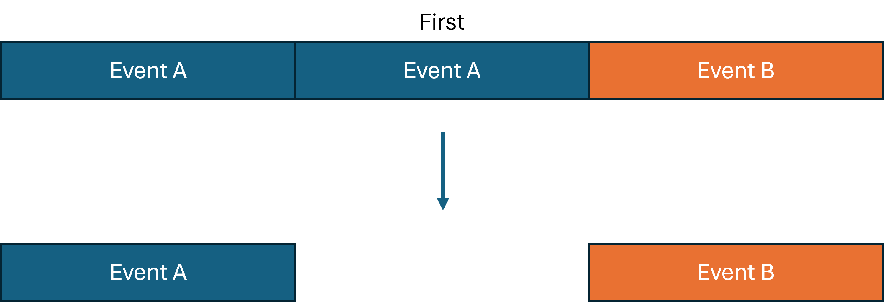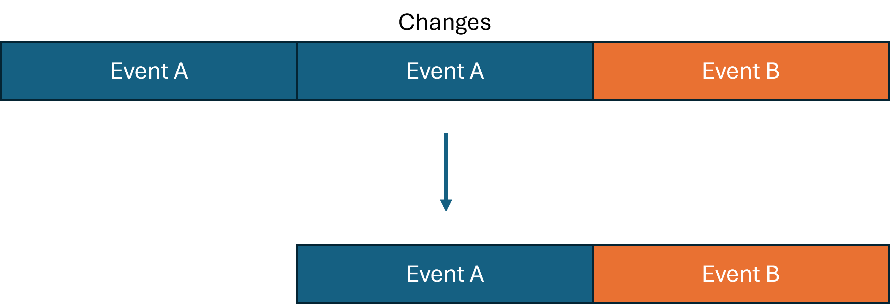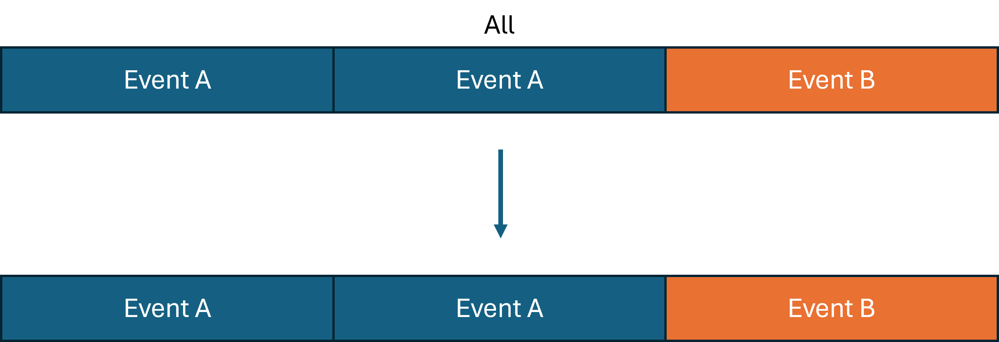

When we set `filterTreatments = "All"` we can additionally collapse
multiple occurring records of one event, into one record. The
`eraCollapseSize` specifies the gap that between two of the same event
that should be collapsed.

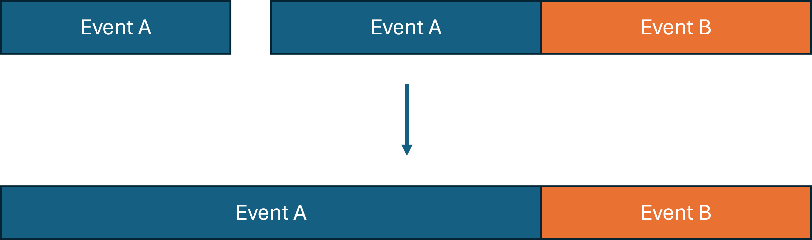

``` r
computePathways(
  cohorts = cohorts,
  cohortTableName = "cohort_table",
  cdm = cdm,
  minEraDuration = 30,
  eraCollapseSize = 30,
  filterTreatments = "First"
)
```

## Combinations

TreatmentPatterns can classify combination events within the supplied
events. It will look for overlap for all the occurring events. Not all
overlap is classified as a combination. This is dictated by the
`combinationWindow` parameter. This parameter specifies the minimum
duration of overlap between two events to classify as a
combination-event.

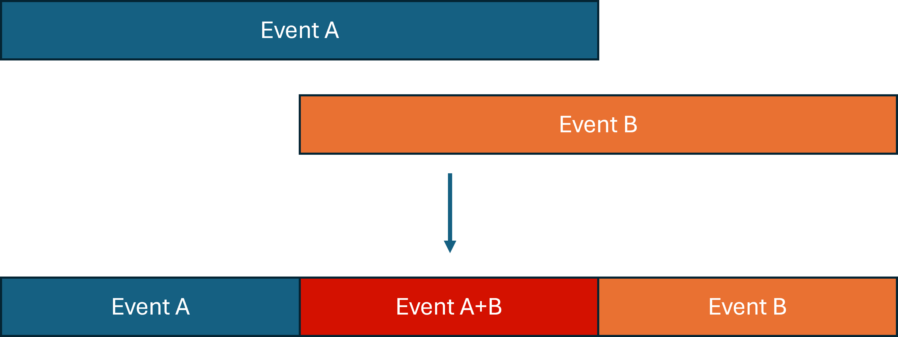

Effectively we split the two event records in three records: 1) Event A,
2) Event B, and 3) The combination of event B and C.

The `minPostCombinationDuration` parameter dictates what to do with the
newly created events records. Because we could end up with a remaining
duration of Event A and Event B that will only last 1 day.
`minPostCombinationDuration` dictates the minimum duration of these
newly created records, removing events that last shorter then the
specified time in days. It is therefore usually unwise to specify the
`minEraDuration` smaller than the `combinationWindow`.

``` r
computePathways(
  cohorts = cohorts,
  cohortTableName = "cohort_table",
  cdm = cdm,
  combinationWindow = 30,
  minPostCombinationDuration = 30
)
```

### Non-Significant Overlap

Overlap is deemed not significant, the event transition is classified as
a *switch* of events. The first treatment is then trucated to the index
date of the overlapping event (in this case **Event B**). If you’re only
interrested in the final pathways that TreatmentPatterns generates, this
does not influence your resulting pathways (barring some edge cases).
However when you’d like to investigate the patient-level records
generated by
[`computePathways()`](https://darwin-eu-dev.github.io/TreatmentPatterns/reference/computePathways.md)
this might lead to undesired end dates.

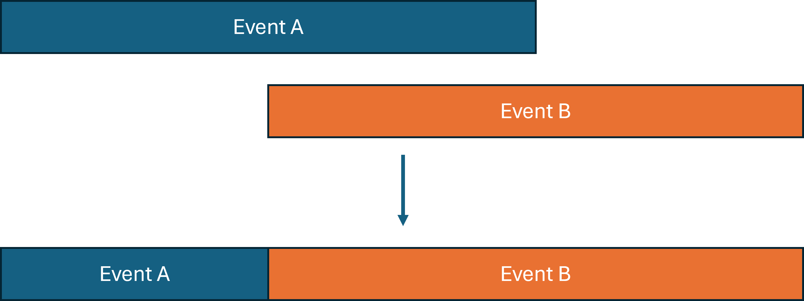

## Overlap Method

The `overlapMethod` parameter allows you to specify what method to use
to deal with this non-significant overlap: `"truncate"` to truncate the
first event, as described before:

``` r
outputEnv <- computePathways(
  cohorts = cohorts,
  cohortTableName = "cohort_table",
  cdm = cdm,
  overlapMethod = "truncate"
)
```

Or `"keep"`, to keep the start and end dates of both records intact:

``` r
outputEnv <- computePathways(
  cohorts = cohorts,
  cohortTableName = "cohort_table",
  cdm = cdm,
  overlapMethod = "keep"
)
```

## Acute and Therapy Splits

We can split specific events into *acute* and *therapy* events. We do
this by selecting our events of interest by `cohort_definition_id` (or
`cohortId`) in the `splitEventCOhorts` parameter. We then set a cutoff
for the minimum amount of **days** we would like to classify as
*therapy* with `splitTime`. The first *n* days will be classified as
*acute* and remaining duration will be classified as *therapy*.

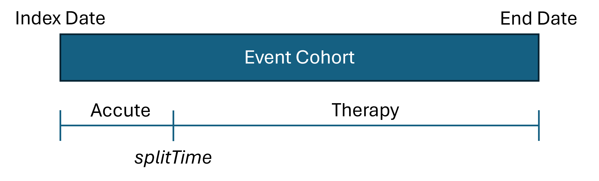

Let’s say we want to assume that the first 60 days of our treatment is
acute, and beyond that therapy.

``` r
outputEnv <- computePathways(
  cohorts = cohorts,
  cohortTableName = "cohort_table",
  cdm = cdm,
  splitEventCohorts = c(1, 2),
  splitTime = 30
)
```

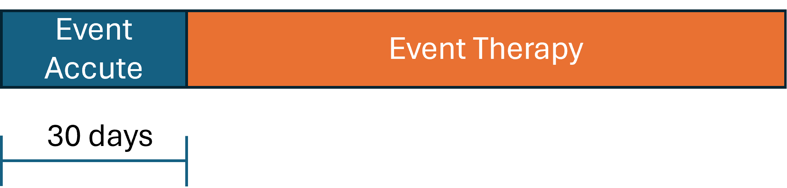

## Event Windows

### Anchoring

The
[`computePathways()`](https://darwin-eu-dev.github.io/TreatmentPatterns/reference/computePathways.md)
function has two ‘anchor’ arguments, `startAnchor` and `endAnchor`.
These arguments dictate what point to use as a reference. The two values
that you can set for both of these parameters are: `"startDate"` and
`"endDate"`, referencing the `cohort_start_date` and `cohort_end_date`
columns in the cohort table. By default they are set to:
`startAnchor = "startDate"` and `endAnchor = "endDate"`

### windowStart and windowEnd

The `windowStart` and `windowEnd` parameters dictate an offset from
their corresponding *anchor*. If we assuming the following parameters
(defaults):

    startAnchor = "startDate"
    windowStart = 0
    endAnchor = "endDate"
    windowEnd = 0

We will just use the `cohort_start_date` and `cohort_end_date` as our
window of interest.

``` r
outputEnv <- computePathways(
  cohorts = cohorts,
  cohortTableName = "cohort_table",
  cdm = cdm,
  startAnchor = "startDate",
  windowStart = 0,
  endAnchor = "endDate",
  windowEnd = 0
)
```

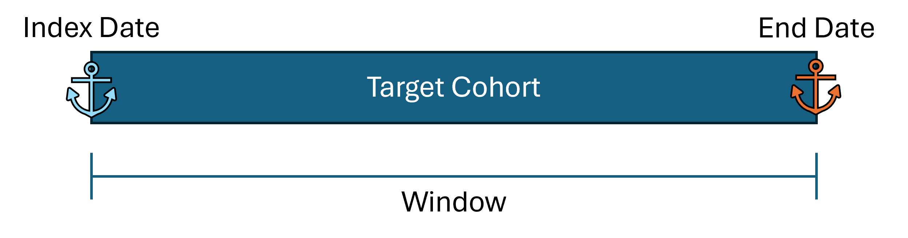

We can extend our window with a 30 days on either side by altering the
`windowStart` and `windowEnd` variables:

    startAnchor = "startDate"
    windowStart = -30
    endAnchor = "endDate"
    windowEnd = 30

Note that `windowStart = -30`, as in we subtract 30 days from the
`startAnchor`. `windowEnd = 30` as in we add 30 days to the `endAnchor`.

``` r
outputEnv <- computePathways(
  cohorts = cohorts,
  cohortTableName = "cohort_table",
  cdm = cdm,
  startAnchor = "startDate",
  windowStart = -30,
  endAnchor = "endDate",
  windowEnd = 30
)
```

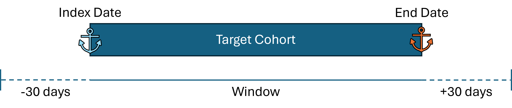

### Changing the anchoring

We can change the anchoring of `startAnchor` and `endAnchor` to set our
window to a period prior to the index date:

    startAnchor = "startDate"
    windowStart = -30
    endAnchor = "startDate"
    windowEnd = 0

Note that we set **both** the `startAnchor` and `endAnchor` are set to
`"startDate"`. So we start -30 days from the index date, and end on the
index date.

``` r
outputEnv <- computePathways(
  cohorts = cohorts,
  cohortTableName = "cohort_table",
  cdm = cdm,
  startAnchor = "startDate",
  windowStart = -30,
  endAnchor = "startDate",
  windowEnd = 0
)
```

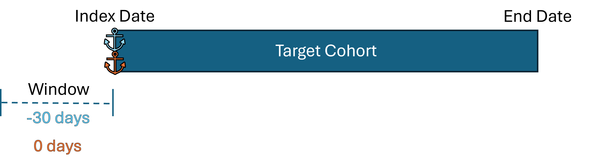 \## Pathways Finally we can also dictate
some parameters of the pathway. We can specify the maximum length of the
pathways with `maxPathLength`. This parameter will truncate the pathways
that exceed the set limit.

We can also set `concatTargets` to either `TRUE` or `FALSE`. When set to
`TRUE` it will append multiple cases, which might be useful for time
invariant target cohorts like chronic conditions. If you would like to
evaluate each occurrence of a target cohort seperately, we can set it to
`FALSE`.

## Running the analysis

After careful consideration of the settings, we can run our Treatment
Patterns analysis:

``` r
library(TreatmentPatterns)

# Computing pathways
outputEnv <- computePathways(
  cohorts = cohorts,
  cohortTableName = "cohort_table",
  cdm = cdm,
  analysisId = 1,
  description = "My Treatment Pathway analysis",

  # Window
  startAnchor = "startDate",
  windowStart = 0,
  endAnchor = "endDate",
  windowEnd = 0,

  # Acute / Therapy
  splitEventCohorts = NULL,
  splitTime = NULL,

  # Events
  minEraDuration = 7,
  filterTreatments = "All",
  eraCollapseSize = 3,

  # Combinations
  combinationWindow = 7,
  minPostCombinationDuration = 7,
  overlapMethod = "truncate",

  # Pathways
  maxPathLength = 10,
  concatTargets = FALSE
)
```

    ## -- Qualifying records for cohort definitions: 1, 2, 3, 4, 5, 6, 7, 8
    ##  Records: 14041
    ##  Subjects: 2693

    ## -- Removing records < minEraDuration (7)
    ##  Records: 11347
    ##  Subjects: 2159

    ## >> Starting on target: 8 (viralsinusitis)

    ## -- Removing events outside window (startDate: 0 | endDate: 0)
    ##  Records: 8327
    ##  Subjects: 2142

    ## -- splitEventCohorts
    ##  Records: 8327
    ##  Subjects: 2142

    ## -- No eras needed Collapsing, eraCollapse (3)
    ##  Records: 8327
    ##  Subjects: 2142

    ## -- Iteration 1: minPostCombinationDuration (7), combinatinoWindow (7)
    ##  Records: 6799
    ##  Subjects: 2142

    ## -- Iteration 2: minPostCombinationDuration (7), combinatinoWindow (7)
    ##  Records: 6663
    ##  Subjects: 2142

    ## -- Iteration 3: minPostCombinationDuration (7), combinatinoWindow (7)
    ##  Records: 6662
    ##  Subjects: 2142

    ## -- After Combination
    ##  Records: 6662
    ##  Subjects: 2142

    ## -- filterTreatments (All)
    ##  Records: 6662
    ##  Subjects: 2142

    ## -- Max path length (10)
    ##  Records: 6662
    ##  Subjects: 2142

    ## -- treatment construction done
    ##  Records: 6662
    ##  Subjects: 2142

The result is an `Andromeda` object that contains patient-level data. We
will go into exporting the results to share-able files in the
**Exporting** vignette.
