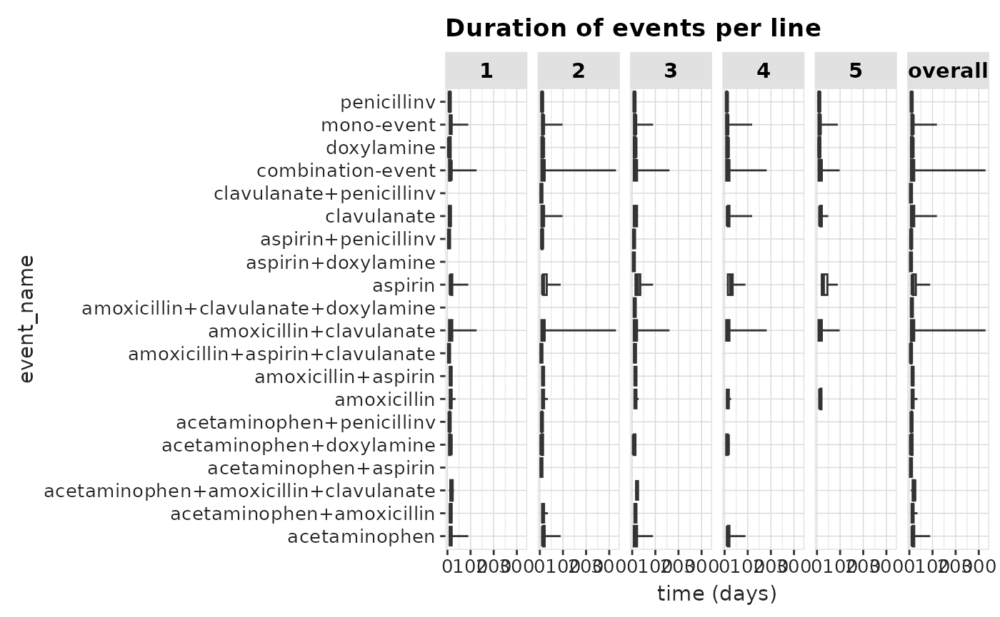
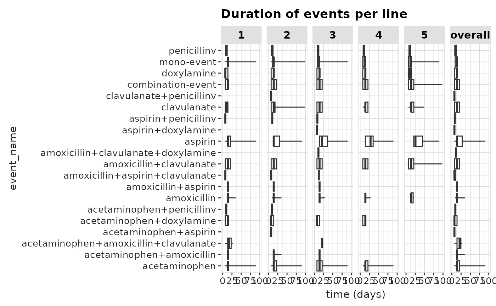
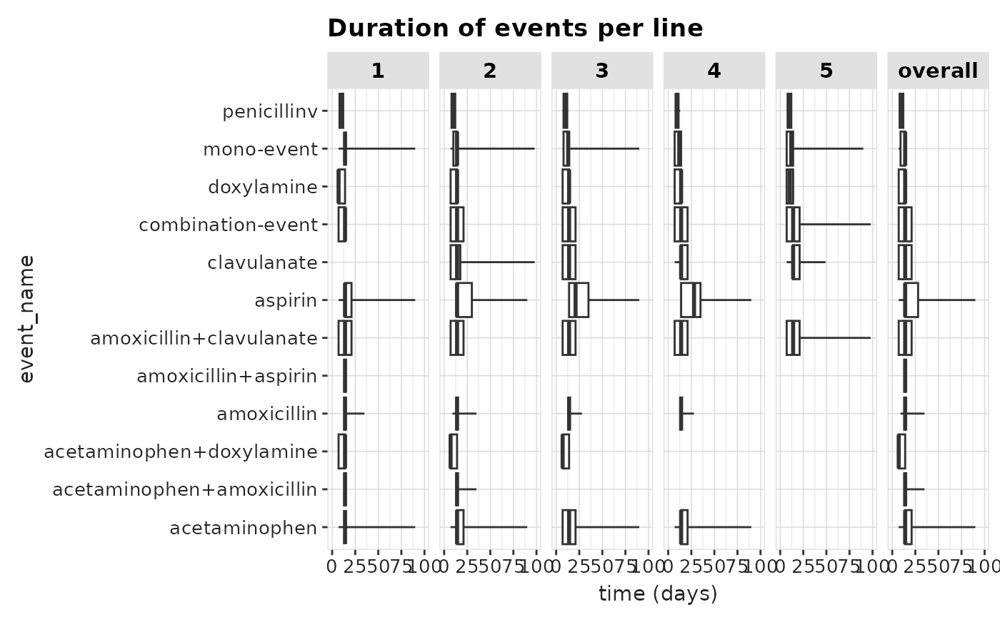

# Evaluating Output

For this example we take the case of *Viral Sinusitis* and several
treatments as events. We set our `minEraDuration = 7`,
`minCombinationDuration = 7` and `combinationWindow = 7`. We treat
multiple events of *Viral Sinusitis* as separate cases by setting
`concatTargets = FALSE`. When set to `TRUE` it would append multiple
cases, which might be useful for time invariant target cohorts like
chronic conditions.

``` r
library(CDMConnector)
library(dplyr)
```

    ## 
    ## Attaching package: 'dplyr'

    ## The following objects are masked from 'package:stats':
    ## 
    ##     filter, lag

    ## The following objects are masked from 'package:base':
    ## 
    ##     intersect, setdiff, setequal, union

``` r
library(TreatmentPatterns)

cohortSet <- CDMConnector::readCohortSet(
  path = system.file(package = "TreatmentPatterns", "exampleCohorts")
)

con <- DBI::dbConnect(
  drv = duckdb::duckdb(),
  dbdir = CDMConnector::eunomiaDir()
)
```

    ## Downloading GiBleed

    ## 
    ## Download completed!

    ## Creating CDM database /tmp/RtmpailPfZ/file4071520ddd6a/GiBleed_5.3.zip

``` r
cdm <- CDMConnector::cdmFromCon(
  con = con,
  cdmSchema = "main",
  writeSchema = "main"
)

cdm <- CDMConnector::generateCohortSet(
  cdm = cdm,
  cohortSet = cohortSet,
  name = "cohort_table",
  overwrite = TRUE
)
```

    ## ℹ Generating 8 cohorts

    ## ℹ Generating cohort (1/8) - acetaminophen

    ## ✔ Generating cohort (1/8) - acetaminophen [363ms]

    ## 

    ## ℹ Generating cohort (2/8) - amoxicillin

    ## ✔ Generating cohort (2/8) - amoxicillin [214ms]

    ## 

    ## ℹ Generating cohort (3/8) - aspirin

    ## ✔ Generating cohort (3/8) - aspirin [172ms]

    ## 

    ## ℹ Generating cohort (4/8) - clavulanate

    ## ✔ Generating cohort (4/8) - clavulanate [160ms]

    ## 

    ## ℹ Generating cohort (5/8) - death

    ## ✔ Generating cohort (5/8) - death [144ms]

    ## 

    ## ℹ Generating cohort (6/8) - doxylamine

    ## ✔ Generating cohort (6/8) - doxylamine [155ms]

    ## 

    ## ℹ Generating cohort (7/8) - penicillinv

    ## ✔ Generating cohort (7/8) - penicillinv [149ms]

    ## 

    ## ℹ Generating cohort (8/8) - viralsinusitis

    ## ✔ Generating cohort (8/8) - viralsinusitis [240ms]

    ## 

``` r
cohorts <- cohortSet %>%
  # Remove 'cohort' and 'json' columns
  dplyr::select(-"cohort", -"json", -"cohort_name_snakecase") %>%
  dplyr::mutate(
    type = c(
      "event", "event", "event", "event",
      "exit", "event", "event", "target"
    )
  ) %>%
  dplyr::rename(
    cohortId = "cohort_definition_id",
    cohortName = "cohort_name",
  )

outputEnv <- TreatmentPatterns::computePathways(
  cohorts = cohorts,
  cohortTableName = "cohort_table",
  cdm = cdm,
  minEraDuration = 7,
  combinationWindow = 7,
  minPostCombinationDuration = 7,
  concatTargets = FALSE
)
```

    ## -- Qualifying records for cohort definitions: 1, 2, 3, 4, 5, 6, 7, 8
    ##  Records: 14041
    ##  Subjects: 2693

    ## -- Removing records < minEraDuration (7)
    ##  Records: 11347
    ##  Subjects: 2159

    ## >> Starting on target: 8 (viralsinusitis)

    ## -- Removing events outside window (startDate: 0 | endDate: 0)
    ##  Records: 8327
    ##  Subjects: 2142

    ## -- splitEventCohorts
    ##  Records: 8327
    ##  Subjects: 2142

    ## -- No eras needed Collapsing, eraCollapse (30)
    ##  Records: 8327
    ##  Subjects: 2142

    ## -- Iteration 1: minPostCombinationDuration (7), combinatinoWindow (7)
    ##  Records: 6799
    ##  Subjects: 2142

    ## -- Iteration 2: minPostCombinationDuration (7), combinatinoWindow (7)
    ##  Records: 6663
    ##  Subjects: 2142

    ## -- Iteration 3: minPostCombinationDuration (7), combinatinoWindow (7)
    ##  Records: 6662
    ##  Subjects: 2142

    ## -- After Combination
    ##  Records: 6662
    ##  Subjects: 2142

    ## -- filterTreatments (First)
    ##  Records: 6657
    ##  Subjects: 2142

    ## -- Max path length (5)
    ##  Records: 6653
    ##  Subjects: 2142

    ## -- treatment construction done
    ##  Records: 6653
    ##  Subjects: 2142

``` r
results <- TreatmentPatterns::export(
  andromeda = outputEnv,
  minCellCount = 1,
  nonePaths = TRUE,
  outputPath = tempdir()
)
```

    ## Wrote csv-files to: /tmp/RtmpailPfZ

## Saving results

Now that we ran our TreatmentPatterns analysis and have exported our
results, we can evaluate the output. The
[`export()`](https://darwin-eu-dev.github.io/TreatmentPatterns/reference/export.md)
function in TreatmentPatterns returns an R6 class of
`TreatmentPatternsResults`. All results are query-able from this object.
Additionally the files are written to the specified `outputPath`. If no
`outputPath` is set, only the result object is returned, and no files
are written.

If you would like to save the results to csv-, or zip-file after the
fact you can still do this. Or upload it to a database:

``` r
# Save to csv-, zip-file
results$saveAsCsv(path = tempdir())
```

    ## Wrote csv-files to: /tmp/RtmpailPfZ

``` r
results$saveAsZip(path = tempdir(), name = "tp-results.zip")
```

    ## Wrote zip-file to: /tmp/RtmpailPfZ

``` r
# Upload to database
connectionDetails <- DatabaseConnector::createConnectionDetails(
  dbms = "sqlite",
  server = file.path(tempdir(), "db.sqlite")
)

results$uploadResultsToDb(
  connectionDetails = connectionDetails,
  schema = "main",
  prefix = "tp_",
  overwrite = TRUE,
  purgeSiteDataBeforeUploading = FALSE
)
```

    ## 
    ## Attaching package: 'DatabaseConnector'

    ## The following objects are masked from 'package:CDMConnector':
    ## 
    ##     dbms, insertTable

    ## Connecting using SQLite driver
    ## Uploading file: attrition.csv to table: attrition

    ## Warning: The following named parsers don't match the column names: time

    ## - Preparing to upload rows 1 through 12

    ## Inserting data took 0.0206 secs
    ## Uploading file: counts_age.csv to table: counts_age

    ## - Preparing to upload rows 1 through 63

    ## Inserting data took 0.0298 secs
    ## Uploading file: counts_sex.csv to table: counts_sex

    ## - Preparing to upload rows 1 through 2

    ## Inserting data took 0.00801 secs
    ## Uploading file: counts_year.csv to table: counts_year

    ## Warning: The following named parsers don't match the column names: year

    ## - Preparing to upload rows 1 through 52

    ## Inserting data took 0.00816 secs
    ## Uploading file: metadata.csv to table: metadata

    ## - Preparing to upload rows 1 through 1

    ## Inserting data took 0.00823 secs
    ## Uploading file: summary_event_duration.csv to table: summary_event_duration

    ## Warning: The following named parsers don't match the column names: min, q1,
    ## median, q2, max, average, sd, count

    ## - Preparing to upload rows 1 through 88

    ## Inserting data took 0.00985 secs
    ## Uploading file: treatment_pathways.csv to table: treatment_pathways

    ## Warning: The following named parsers don't match the column names: path

    ## - Preparing to upload rows 1 through 372

    ## Inserting data took 0.0088 secs
    ## Uploading file: cdm_source_info.csv to table: cdm_source_info

    ## - Preparing to upload rows 1 through 1

    ## Inserting data took 0.00901 secs
    ## Uploading file: analyses.csv to table: analyses

    ## - Preparing to upload rows 1 through 1

    ## Inserting data took 0.00735 secs
    ## Uploading file: arguments.csv to table: arguments

    ## - Preparing to upload rows 1 through 1

    ## Inserting data took 0.00745 secs

    ## Uploading data took 7.22 secs

## Evaluating Results

### treatmentPathways

The treatmentPathways file contains all the pathways found, with a
frequency, pairwise stratified by age group, sex and index year.

``` r
head(results$treatment_pathways)
```

    ## # A tibble: 6 × 8
    ##   pathway               freq age   sex   index_year analysis_id target_cohort_id
    ##   <chr>                <int> <chr> <chr> <chr>            <dbl>            <dbl>
    ## 1 acetaminophen-amoxi…   103 all   all   all                  1                8
    ## 2 acetaminophen-penic…    55 all   all   all                  1                8
    ## 3 aspirin-acetaminoph…    52 all   all   all                  1                8
    ## 4 acetaminophen-penic…    49 all   all   all                  1                8
    ## 5 acetaminophen-amoxi…    42 all   all   all                  1                8
    ## 6 acetaminophen-aspir…    41 all   all   all                  1                8
    ## # ℹ 1 more variable: target_cohort_name <chr>

We can see the pathways contain the treatment names we provided in our
event cohorts. Besides that we also see the paths are annoted with a `+`
or `-`. The `+` indicates two treatments are a combination therapy,
i.e. `amoxicillin+clavulanate` is a combination of *amoxicillin* and
*clavulanate*. The `-` indicates a switch between treatments,
i.e. `acetaminophen-penicillinv` is a switch from *acetaminophen* to
*penicillin v*. Note that these combinations and switches can occur in
the same pathway, i.e. `acetaminophen-amoxicillin+clavulanate`. The
first treatment is *acetaminophen* that *switches* to a combination of
*amoxicillin* and *clavulanate*.

### countsAge, countsSex, and countsYear

The countsAge, countsSex, and countsYear contain counts per age, sex,
and index year.

``` r
head(results$counts_age)
```

    ## # A tibble: 6 × 5
    ##     age n     analysis_id target_cohort_id target_cohort_name
    ##   <dbl> <chr>       <dbl>            <dbl> <chr>             
    ## 1     1 151             1                8 viralsinusitis    
    ## 2     2 334             1                8 viralsinusitis    
    ## 3     3 263             1                8 viralsinusitis    
    ## 4     4 186             1                8 viralsinusitis    
    ## 5     5 174             1                8 viralsinusitis    
    ## 6     6 112             1                8 viralsinusitis

``` r
head(results$counts_sex)
```

    ## # A tibble: 2 × 5
    ##   sex    n     analysis_id target_cohort_id target_cohort_name
    ##   <chr>  <chr>       <dbl>            <dbl> <chr>             
    ## 1 FEMALE 1092            1                8 viralsinusitis    
    ## 2 MALE   1067            1                8 viralsinusitis

``` r
head(results$counts_year)
```

    ## # A tibble: 6 × 5
    ##   index_year n     analysis_id target_cohort_id target_cohort_name
    ##        <dbl> <chr>       <dbl>            <dbl> <chr>             
    ## 1       1950 43              1                8 viralsinusitis    
    ## 2       1951 40              1                8 viralsinusitis    
    ## 3       1952 54              1                8 viralsinusitis    
    ## 4       1953 47              1                8 viralsinusitis    
    ## 5       1954 47              1                8 viralsinusitis    
    ## 6       1955 49              1                8 viralsinusitis

### summaryStatsTherapyDuration

The summaryEventDuration contains summary statistics from different
events, across all found “lines”. A “line” is equal to the level in the
Sunburst or Sankey diagrams. The summary statistics allow for plotting
of boxplots with the
[`plotEventDuration()`](https://darwin-eu-dev.github.io/TreatmentPatterns/reference/plotEventDuration.md)
function.

``` r
results$plotEventDuration()
```



Not that besides our events there are two extra rows: *mono-event*, and
*combination-event*. These are both types of events on average.

We see that most events last between 0 and 100 days. We can see that for
*combination-events* and *amoxicillin+clavulanate* there is a tendency
for events to last longer than that. *amoxicillin+clavulanate* most
likely skews the duration in the *combination-events* group.

We can alter the x-axis to get a clearer view of the durations of the
events:

``` r
results$plotEventDuration() +
  ggplot2::xlim(0, 100)
```

 Now
we can more clearly investigate particular treatments. We can see that
*penicilin v* tends to last quite short across all treatment lines,
while *aspirin* and *acetaminophen* seem to skew to a longer duration.

Additionally we can also set a `minCellCount` for the individual events.

``` r
results$plotEventDuration(minCellCount = 10) +
  ggplot2::xlim(0, 100)
```



### metadata

The metadata file is a file that contains information about the
circumstances the analysis was performed in, and information about R,
and the CDM.

``` r
results$metadata
```

    ## # A tibble: 1 × 6
    ##   execution_start package_version r_version   platform execution_end analysis_id
    ##             <dbl> <chr>           <chr>       <chr>            <dbl>       <dbl>
    ## 1     1770798710. 3.1.2           R version … x86_64-…   1770798734.           1

### Sunburst Plot & Sankey Diagram

From the filtered treatmentPathways file we are able to create a
sunburst plot.

The inner most layer is the first event that occurs, going outwards.
This aligns with the event duration plot we looked at earlier.

``` r
results$plotSunburst()
```

Legend

We can also create a Sankey Diagram, which in theory displays the same
data. Additionally you see the *Stopped* node in the Sankey diagram.
This indicates the end of the pathway. It is mostly a practical addition
so that single layer Sankey diagrams can still be plotted.

``` r
results$plotSankey()
```
